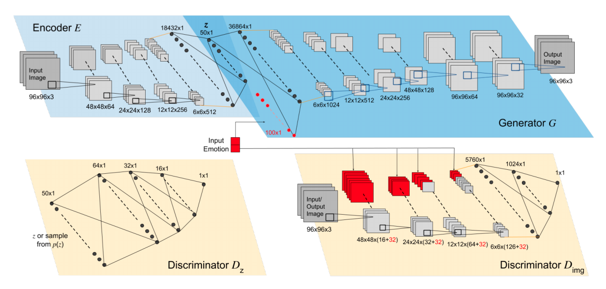

Training and testing model presented in the following publication:
 - Model for the paper: Lindt, A., Barros, P., Siqueira, H., &amp; Wermter, S. (2019, May). Facial expression editing with continuous emotion labels. In 2019 14th IEEE International Conference on Automatic Face &amp; Gesture Recognition (FG 2019) (pp. 1-8). IEEE.

##Pre-requisites
Install the requirements from the Requirements.txt file.

##Continual Face Expression Edditing

we explore how continuous emotion
representations can be used to control automated expression
editing. We propose a deep generative model that can be used
to manipulate facial expressions in facial images according
to continuous two-dimensional emotion labels. One dimension
represents an emotion’s valence, the other represents its degree
of arousal.

##Face Editing

The Experiments folder holds our experimental setup routine. Faces are edited using our
proposed network and a range of arousals and valences.

##Trained Network

We provide a trained network that can be evaluated by running the editFaces.py script.

## Use and distribution policy

All the examples in this repository are distributed under a Non-Comercial license. If you use this environment, you have to agree with the following itens:

- To cite our associated references in any of your publication that make any use of these examples.
- To use the environment for research purpose only.
- To not provide the environment to any second parties.

## Citations

- Barros, P., Parisi, G., & Wermter, S. (2019, May). A Personalized Affective Memory Model for Improving Emotion Recognition. In International Conference on Machine Learning (pp. 485-494).

- Lindt, A., Barros, P., Siqueira, H., &amp; Wermter, S. (2019, May). Facial expression editing with continuous emotion labels. In 2019 14th IEEE International Conference on Automatic Face &amp; Gesture Recognition (FG 2019) (pp. 1-8). IEEE.

## Contact

Pablo Barros - pablo.alvesdebarros@iit.it

- [http://pablobarros.net](http://pablobarros.net)
- [Twitter](https://twitter.com/PBarros_br)
- [Google Scholar](https://scholar.google.com/citations?user=LU9tpkMAAAAJ)

